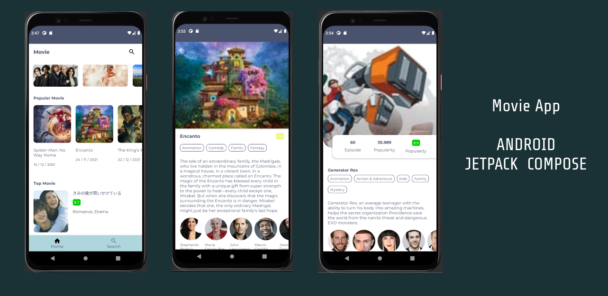

# MovieJetPackCompose

Sample project built with Android Jetpack Compose this application implements api from [themoviedb](http://themoviedb.org).

## Getting Started
add api key themoviedb to `app/build.gradle`, attribute `API_KEY` line 19

#### Libraries

* [Retrofit](https://square.github.io/retrofit/)
* [OkHttp](https://square.github.io/okhttp/)
* [Coil](https://coil-kt.github.io/coil/)
* [Toolbar Compose](https://github.com/onebone/compose-collapsing-toolbar)
* [Toolbar Compose](https://github.com/onebone/compose-collapsing-toolbar)
